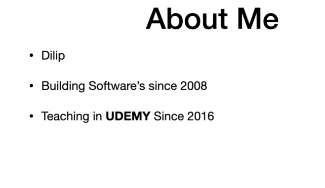
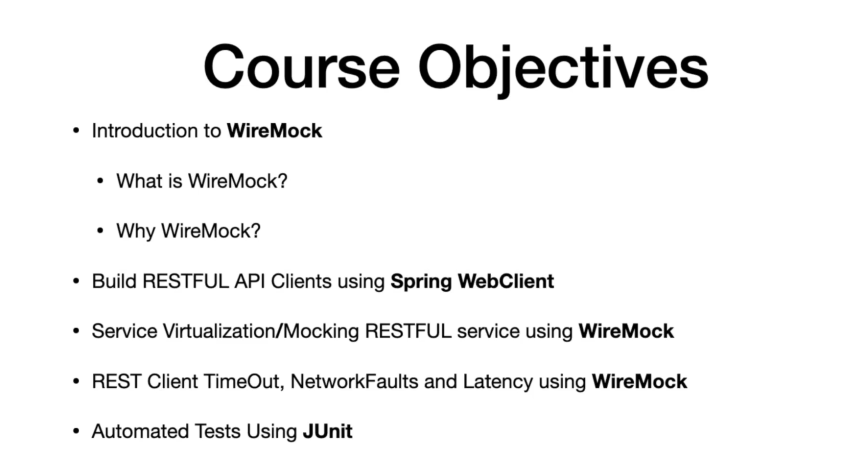
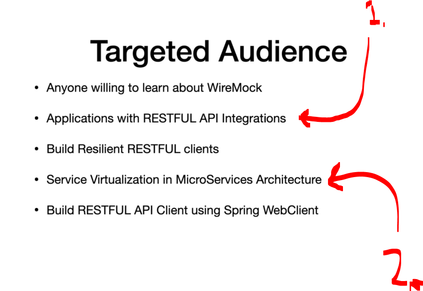
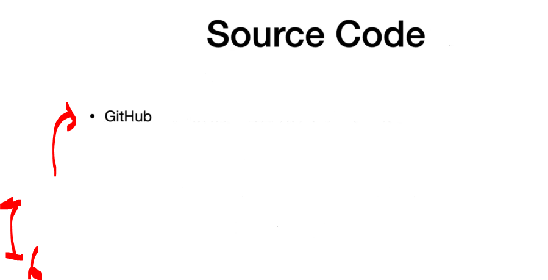
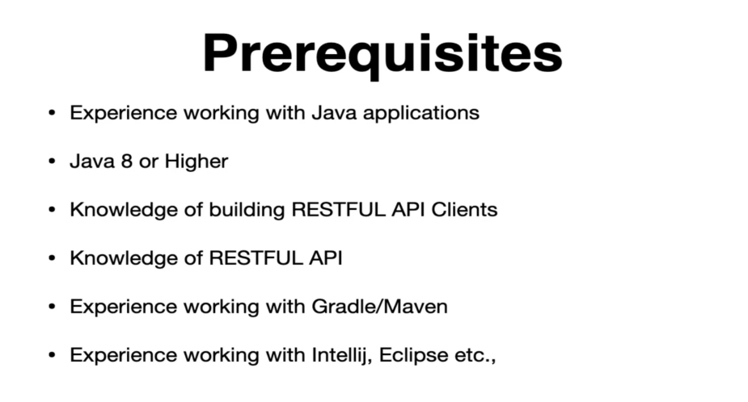

# Section 01: Getting Started with Course. 

Getting Started with Course.

# What I Learned

# Course Introduction & Objectives.

    

    

    

    

1. RESTFUL API Integration testing!
2. If one wants to build tests for service, which depends on the other services!
    - This will give pretty good idea.

    

1. Codes are at GitHub and the links are in the course!

    

1. Thank you!

# Pre-Requisites.

    

