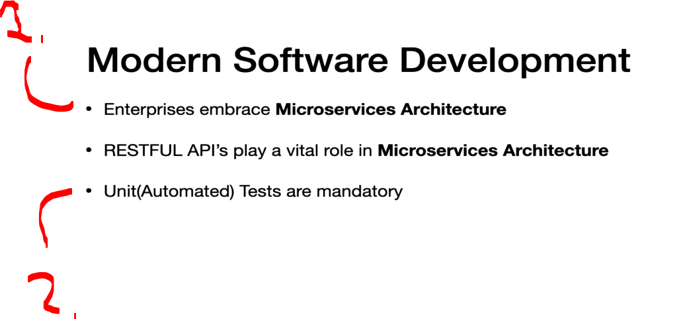
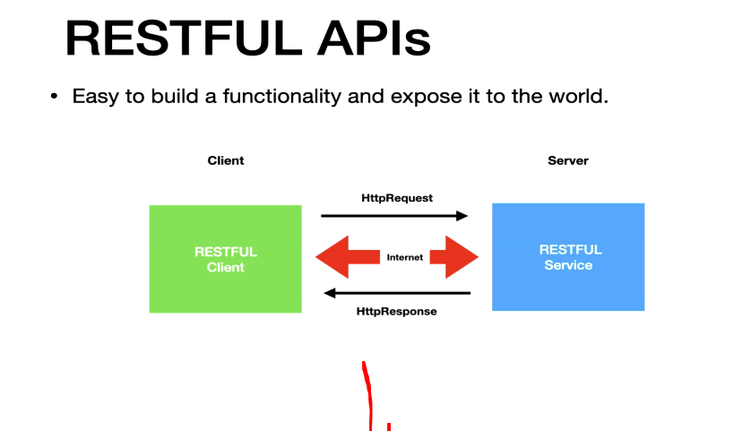
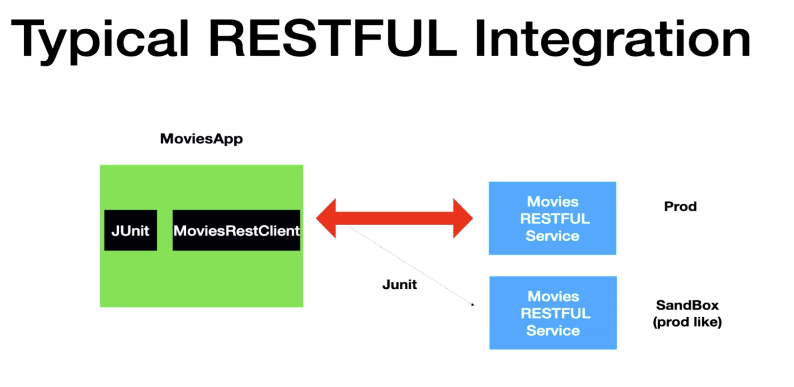
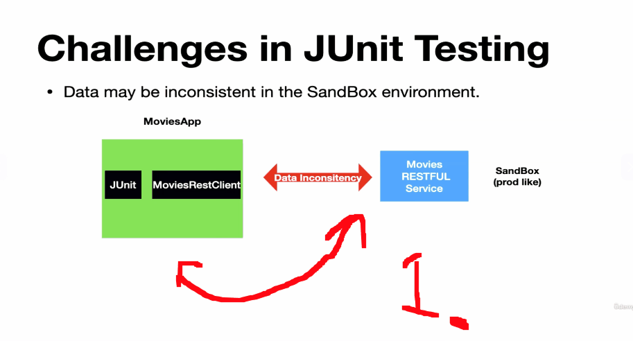
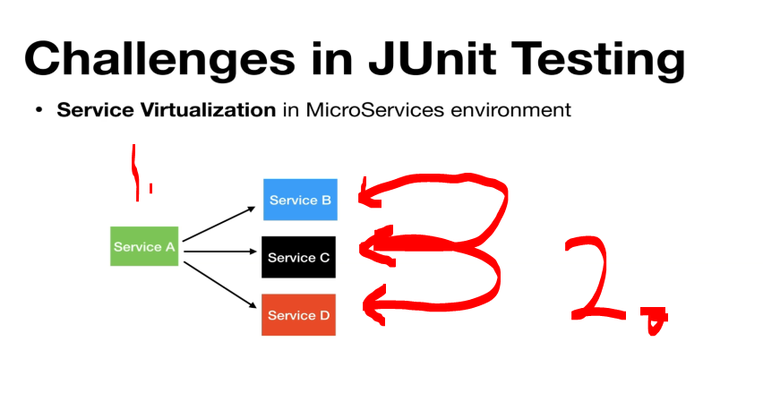
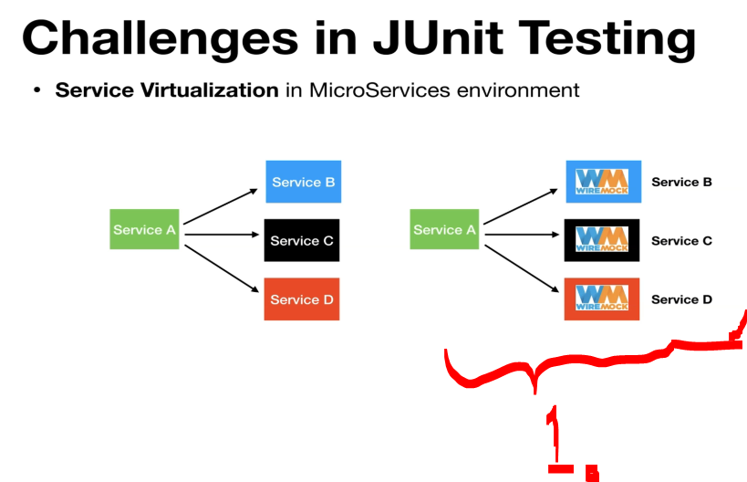
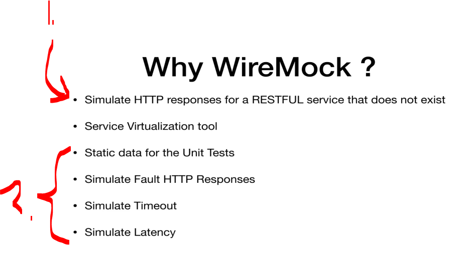
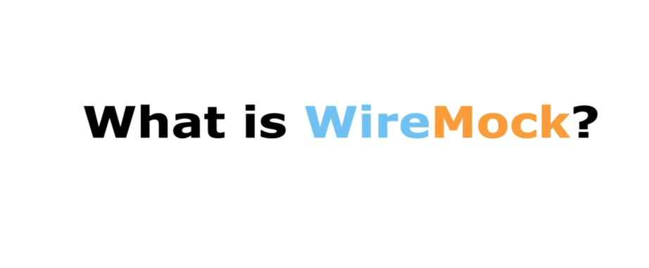

# Section 02: Introduction to WireMock. 

# What I Learned

# Why WireMock?  

    

1. Most **enterprise** business are already transferred into **Microservice Architecture**.
2. Unit test are mandatory!
    - There is less fear, when shipping features when there are automated test!

    

1. There is client and server. They access each other using endpoints using **HTTP** in internet.

    

1. The Movies RESTFUL Services is **third party** company providing services.
2. **MoviesApp** is our client application! 
    - We will have `MoviesRestClient`, in which the **REST API** calls will be made!
- We will have automated test to check for integration for as expected, this is done with **JUnit**.
3. Third party will have third party sandbox environment.
    - This is like **production like environment**.

    

1. What can be tested inside **sandbox environment**.
    - **2xx responses** and **4xx response**!

> [!IMPORTANT]  
>  Just to test these **4xx** and **2xx** are not enough to for a **successful integration**!

    

1. **Three most** important to be tested!
    - **5xx Responses** these are **default** or **fault** responses!
    - **Latency** from the RESTFUL service.
    - **Timeouts** from the **client side** after request have been made!
    - These are **nearly impossible** be tested in **sandbox environment**!
2. **WireMock** comes in handy in these situations!

    

1.

    

1. Usually we have time pressure, where we are making these **parallel** client part and the **third party side**!
2. We are usually created the **contract** first!

    

1. If the **sandbox** environment changed the **contract** in the middle, our **JUnit** would be failing in the `moviesapp` in such scenarios!
    - **Wiremock** has tools for dealing with such scenarios!  

    

1. We have **Service A**, which would be communication on the **Service B**, **Service C** and **Service D**.
    - We would need to write integration test to the **Service A** in same time.
        - It would fail if one of services would be unavailable!

2. Sometimes we would be building these services **parallel** with each other. How one can write test cases in same time. 

    

1. **WireMock** can provide the server virtualization. 
    - We can be **interactive** with these, like it would be real service.

    

1. **WireMock** helps simulate HTTP **REST** responses that do not exist.
2. Can provide these for the caller:
    - Instead of calling real APIs, tests use fixed (mocked) responses.
    - Simulate Fault HTTP Responses:
        - **404** (Not Found).
        - **500** (Server Error).
        - **Invalid payloads**.
    - Simulate Timeout, can delay responses long enough to trigger client timeout handling.
    - Simulate Latency, adds artificial delay to test how the application behaves with slow APIs.

# What is WireMock?  

    

# WireMock vs Mocking Libraries  
